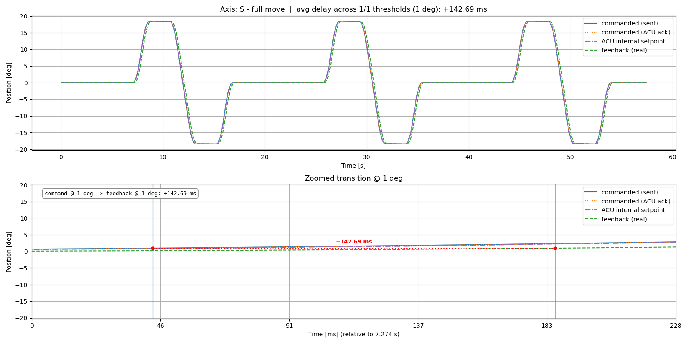
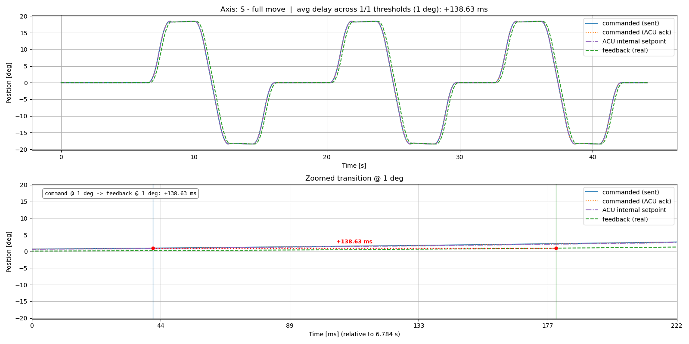
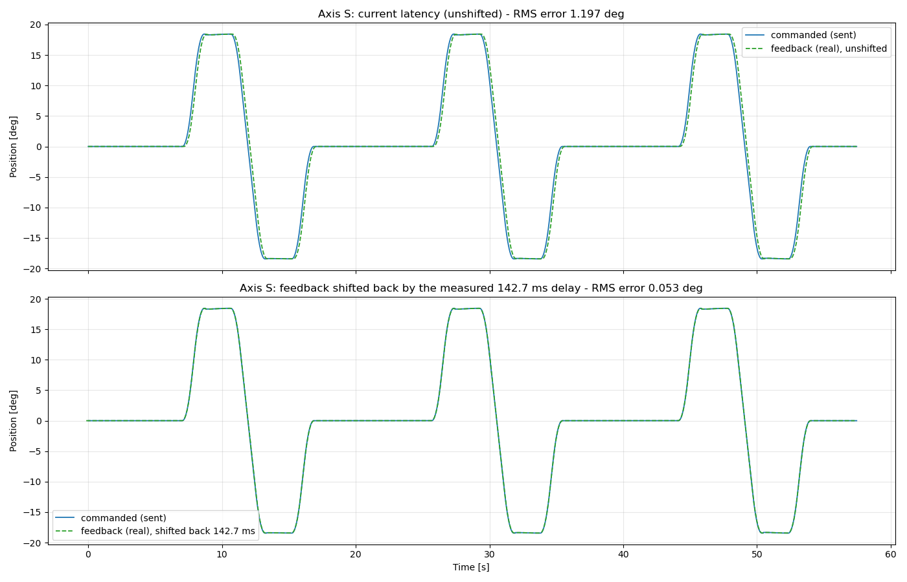
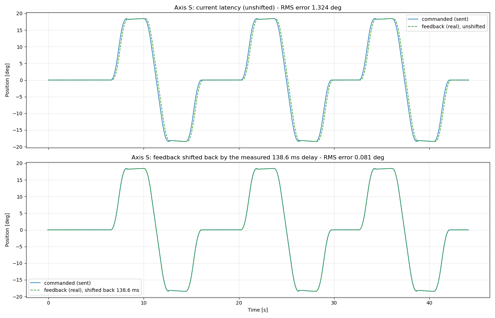
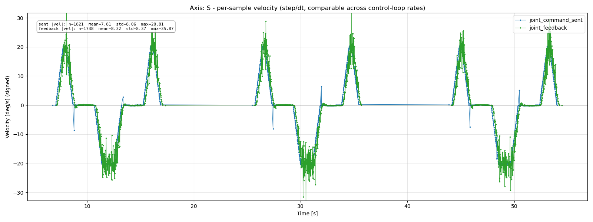
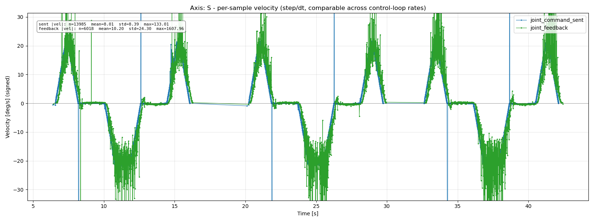

# ynx_motion_analyzer

Records the commanded ("ideal") and feedback ("real") joint trajectories streamed by
`ynx_hardware_interface` during any arm movement, and plots them per axis so tracking
behavior can be inspected visually. Also includes `plot_shift_check`, which checks
whether feedback is well-described as command delayed by a constant amount, and
`latency_test_example`, a MoveIt client that drives a repeatable stop-vs-non-stop loop
for exercising this analysis.

Requires **real hardware** (`use_mock_hardware:=false`). `mock_components/GenericSystem`
never runs `ynx_hardware_interface`'s code, so the topics this tool needs simply don't
exist under mock hardware.

## Experiment recordings live under `experiment/`

`record_motion` saves every bag under `experiment/` (`ynx_motion_analyzer/experiment/`)
by default now - a bare `-o name` is placed there automatically; pass an absolute path
if you deliberately want it somewhere else. All analysis going forward should read from
recordings under that folder rather than scattered elsewhere, so past runs stay easy to
find and compare (e.g. `experiment/sync_loop_bag`, `experiment/async_loop_bag`).

## What gets recorded

`ynx_hardware_interface` publishes four topics every control cycle, for the whole
duration of any movement (not just a specific action call) — four checkpoints of
the same pipeline, in the order they happen:

- `~/joint_command_sent` — the position ros2_control wants this cycle, timestamped
  right before it's handed to the gRPC call ("when ros2_control sent it").
- `~/joint_command` — the same position, timestamped right after the ACU
  acknowledges the gRPC call ("when the ACU received it").
- `~/joint_command_acu` — the ACU's own internal command/setpoint stream
  (`GetAxesPos`) - what the ACU's own interpolator is currently tracking toward,
  reported by the ACU itself. Distinct from `joint_command` (our record of what
  we sent) and from `joint_feedback` (the physical encoder). A failure to read
  this is logged but never fails the control loop - it's recording-only, unlike
  the feedback read.
- `~/joint_feedback` — the actual encoder position/velocity read back from the ACU
  (`GetFeedbackAxesPos`) ("when the arm actually shows it").

The gap between the first two is network/gRPC latency to the ACU; the gap between
the last two is the ACU's own internal + mechanical response latency - and
`joint_command_acu` lets you split that further into "ACU accepted it but hadn't
started tracking yet" vs. "ACU was tracking but the arm hadn't physically caught up."

All four resolve under the hardware component's node, which is nested under
whatever outer namespace bringup was launched with. With `ns:=nex10`, the real
topics are:

```
/nex10/nex10/joint_command_sent
/nex10/nex10/joint_command
/nex10/nex10/joint_command_acu
/nex10/nex10/joint_feedback
```

The first `nex10` is the bringup namespace (`ns:=`); the second is the hardware
component's own node name, hardcoded in `nex10.ros2_control_macro.xacro` regardless
of `ns`. If your `ns` differs, verify the real topic names with `ros2 topic list`.

## Steps to obtain a plot

1. **Build the workspace** (from `ros2_ws/`):
   ```bash
   colcon build
   ```

2. **Launch bringup with real hardware**, in its own terminal:
   ```bash
   source install/setup.bash
   ros2 launch ynx_bringup bringup.launch.py \
     ns:=nex10 ip:=192.168.1.253 port:=50300 \
     use_mock_hardware:=false model:=nex10 \
     launch_rviz:=false launch_servo:=true use_ft_sensor:=false
   ```
   Adjust `ip`/`port`/`ns` for your setup. Wait until it's fully up (servos powered
   on, controllers active) before continuing.

3. **Start recording**, in a new terminal:
   ```bash
   source install/setup.bash
   ros2 run ynx_motion_analyzer record_motion --ns nex10
   ```
   This starts `ros2 bag record` against `joint_command_sent`/`joint_command`/
   `joint_command_acu`/`joint_feedback` and prints the output directory name
   (default `experiment/motion_bag_<timestamp>`; `-o name` also lands under
   `experiment/`, pass an absolute path to override). Leave it running.

4. **Trigger the movement**, in a third terminal:
   ```bash
   source install/setup.bash
   ros2 run ynx_examples move_action_example --ros-args -p ns:=nex10
   ```
   Or run whatever node/script actually commands the arm — the recorder captures
   any movement, regardless of what issued it. To specifically exercise a
   stop-vs-non-stop comparison, use `latency_test_example` instead - see below.

5. **Stop the recording** once the move is done: `Ctrl+C` in the `record_motion`
   terminal. It waits for `ros2 bag record` to shut down gracefully so the bag isn't
   left corrupt/empty.

6. **Generate the plots**:
   ```bash
   ros2 run ynx_motion_analyzer plot_motion {YOUR_MOTION_BAG_PATH} --ns nex10
   ```
   This writes into `{YOUR_MOTION_BAG_PATH}/plot/`:
   ```
   plot/S.png  plot/L.png  plot/U.png  plot/R.png  plot/B.png  plot/T.png
   ```
   Axis names follow the standard Yaskawa MOTOMAN 6-axis convention, in joint
   order (`joint_1`..`joint_6` → S, L, U, R, B, T).

## Reading the plots

The `sent -> ACU ack` gap is only a few milliseconds - invisible on a plot whose
x-axis spans a multi-second move, and even zoomed in, four overlapping
near-identical step lines are hard to tell apart by eye. So don't try to eyeball
delays off the lines directly; read the number this tool computes for you instead:

- **Each `<axis>.png`** has one full-move overview panel plus one zoomed-transition
  panel per `--threshold-deg` value (repeatable - default is just `1.0`, giving
  the classic 2-panel layout, but e.g. `--threshold-deg 1 --threshold-deg 5
  --threshold-deg 10` gives 4 panels and an averaged delay across all three, so
  you can check whether the delay is consistent at different points along the
  same move instead of trusting a single measurement). Every panel shows all
  four checkpoints (sent, ACU ack, ACU internal setpoint, feedback):
  - **Top** — the full move, seconds, unzoomed, for context. Its title reports
    the average delay across however many thresholds were measured.
  - **Each zoomed panel** — the same four lines, auto-zoomed to a
    millisecond-scale window around that threshold's crossing.
    The delay measurement itself still only compares `sent` and `feedback` (the
    two ends of the pipeline) - the ACU-ack and ACU-internal-setpoint lines are
    there for visual context on where the delay comes from, not folded into the
    number. It's: **when command reaches the threshold, what's the latency
    until feedback also reaches it** - both measured from the same shared
    baseline, found by a sequential scan of the recording from its very start:
    1. Scan the commanded (`sent`) position forward until it first moves away
       from its initial (idle) value at all - this only establishes a clean
       baseline (both signals' own value at that moment), it isn't one of the
       two points being compared.
    2. From that baseline, find when `sent` reaches `--threshold-deg`, and
       separately when `feedback` reaches the same `--threshold-deg` (each
       measured from its own value at the baseline moment, so a move that
       begins partway through a bag is measured against the right reference,
       not whatever the first recorded sample happened to be).
    The window is those two "reached threshold" timestamps plus a small margin,
    auto-detected fresh for every axis - there's no manual override, since the
    detection anchors correctly regardless of when in the recording the move
    happens. Each timestamp is marked with a thin color-matched vertical line,
    and since both are the *same* position (both `threshold_deg` past the
    shared baseline), a red dotted line connects them at that shared level with
    the measured gap labeled right on it (and repeated in a text box) - "same
    position, this many ms apart," not something you infer from comparing two
    curves.
- **`--jitter`** — also saves `<axis>_jitter.png` per axis: signed per-sample
  **velocity** (position step ÷ real elapsed `dt`, not raw step size) for
  `joint_command_sent` and `joint_feedback`, across the *whole* recording
  rather than a single zoomed transition, with mean/std/max (of the
  magnitude) annotated for a numeric read instead of just eyeballing the
  line. Velocity, not raw step, because a raw per-sample step is a function
  of how often you happened to sample, not how fast the arm moved - it isn't
  comparable across recordings made at different control-loop rates (e.g.
  the old ~158Hz synchronous loop vs. the current ~500Hz async loop), while
  velocity is. Signed rather than absolute, so the trace follows the move's
  actual wave shape (rises on the outbound leg, dips negative on the way
  back) instead of folding everything into positive-only magnitude - a
  jitter spike stands out precisely because it breaks that recognizable
  shape. Exact-zero steps are dropped before plotting (they're duplicate
  cache reads - e.g. `joint_feedback`'s 250Hz stream cache re-published by
  the 500Hz `read()` loop - not genuine stillness). The y-axis is clipped to
  the 1st-99th percentile of the data so a rare, large, already-understood
  outlier (e.g. a `joint_trajectory_controller` interpolation artifact at a
  zero-velocity segment boundary, amplified by dividing by a small `dt`)
  doesn't stretch the axis and drown out the much smaller "normal" jitter
  this plot exists to show - the point is still in the data and the stats
  box, just clipped from the view.

  Uses `joint_command_sent` (the RT loop's own intended setpoint, published
  every `write()` cycle) rather than `joint_command` (the ACU-ack signal,
  published only when the background sender's `SetIncrementMove` call
  happens to complete). The ACU-ack signal's step size is downstream of
  write-side coalescing and gRPC round-trip variance - it measures how lumpy
  a given send was, not what was actually commanded - so it's the wrong
  signal for asking "does feedback track the intended trajectory smoothly."
  This isn't just visible on a position-vs-time curve at either of
  `plot_axis`'s timescales - it's invisible there entirely, which is why
  this mode exists.
- **`--show`** — opens live, interactive matplotlib windows for every plot, in
  addition to still saving all the PNGs as usual. Use the toolbar's zoom/pan tool
  (rectangle-select) to freely explore any time range down to individual samples.
  Opens one window per axis; close them (or Ctrl+C) to let the script exit. Needs
  a working GUI backend/display (a local X server, X11 forwarding, or WSLg on
  Windows) - if nothing shows up, that's almost always a missing display, not a
  bug in the tool.

## Sanity-checking the delay: is feedback just a delayed copy of command?

`plot_shift_check` answers a narrower question than `plot_motion`: is
`joint_feedback` well-described as `joint_command_sent` delayed by a single
constant amount, or does it actually diverge in shape (damping, overshoot, a
delay that varies with speed/direction)? It measures the command->feedback
delay the same way `plot_motion` does (at `--threshold-deg`), then shifts the
*entire* feedback trace back in time by that one delay value and overlays it
against the commanded trajectory across the whole move - not just at the
single point the delay was measured from. A close match across the whole
move (ramps, plateaus, direction reversals) means the delay is genuinely
close to constant; a lingering mismatch after shifting would mean something
beyond a pure time lag is going on.

```bash
ros2 run ynx_motion_analyzer plot_shift_check async_loop_bag --ns nex10
```

Saves `<axis>_shift_check.png` into `<bag_path>/plot/` per axis - top panel
is the current (unshifted) overlay, bottom panel is feedback shifted back by
the measured delay - and prints the delay and RMS position error (unshifted
vs. shifted) for each axis to the console, e.g.:

```
Axis S: delay=138.80 ms  RMS unshifted=1.188 deg  RMS shifted=0.066 deg  -> Saved async_loop_bag/plot/S_shift_check.png
```

A large RMS drop after shifting (as above, ~18x) confirms feedback tracks
the commanded shape faithfully and the measured delay is representative of
the whole move, not just the threshold-crossing moment.

| Flag | Default | Meaning |
|---|---|---|
| `--ns` | `''` | Same as `plot_motion` |
| `--hw-node` | `nex10` | Same as `plot_motion` |
| `--sent-topic` / `--feedback-topic` | built from `--ns`/`--hw-node` | Override the topic names directly |
| `--axis` | all six | Restrict to specific axes |
| `--threshold-deg` | `1.0` | Same meaning as in `plot_motion`, but single-value here (not repeatable) |
| `--show` | off | Also open live, interactive windows (requires a display) |

## Example: sync vs. async results

`experiment/sync_loop_bag` and `experiment/async_loop_bag` are included as a
concrete before/after reference, both recorded from the same stop-mode loop
move: `sync_loop_bag` is from the original, fully-synchronous `read()`/`write()`
(blocking gRPC calls on the RT thread, ~158Hz effective control loop);
`async_loop_bag` is from the current async-buffered version (background I/O
threads, ~500Hz). These are example outputs, not a permanent characterization
of the system - regenerate them yourself if you want current numbers:

```bash
ros2 run ynx_motion_analyzer plot_motion experiment/sync_loop_bag --ns nex10 --jitter
ros2 run ynx_motion_analyzer plot_motion experiment/async_loop_bag --ns nex10 --jitter
ros2 run ynx_motion_analyzer plot_shift_check experiment/sync_loop_bag --ns nex10
ros2 run ynx_motion_analyzer plot_shift_check experiment/async_loop_bag --ns nex10
```

**Command -> feedback delay stayed about the same** (axis S, `--threshold-deg 1`):

| | sync | async |
|---|---|---|
| delay | +142.69 ms | +138.63 ms |

The async rework targeted control-loop *rate*, not this delay - it's dominated
by trajectory ramp-up and the ACU's own internal + mechanical response, neither
of which `read()`/`write()` touch. Roughly unchanged is the expected result.

A single threshold is one point on the ramp, though - to check the delay is
actually stable rather than a coincidence of where 1° happens to land, the same
measurement was repeated at 20 randomly chosen thresholds (seeded, uniform
between 0.3 deg and ~95% of the peak deviation reached) along the *same first
ramp* in each bag - not 20 different movements scattered across the whole
recording, which the current tooling doesn't do automatically:

| | sync | async |
|---|---|---|
| mean delay (20 samples) | 149.65 ms | 146.93 ms |
| std | 3.95 ms | 3.10 ms |
| min / max | 142.02 / 156.77 ms | 139.90 / 151.06 ms |

Tight std in both (~3-4ms) confirms the delay holds steady across the ramp
rather than drifting, and sync vs. async remain close - consistent with
everything above. This wasn't built as a reusable flag - it's a one-off script
reusing `find_command_start_time`/`find_signal_threshold_time` with randomized
thresholds instead of hand-picked ones; ask if you want it turned into a
proper `plot_motion` mode.

**Feedback is still well-described as command delayed by a constant amount**
(`plot_shift_check`'s RMS error before/after shifting feedback back by the
measured delay):

| | sync | async |
|---|---|---|
| RMS unshifted | 1.197 deg | 1.324 deg |
| RMS shifted | 0.053 deg | 0.081 deg |

Both collapse dramatically once the delay is accounted for, confirming good
tracking fidelity in both versions. Async's shifted RMS is a bit higher - that's
the read-side 500Hz-poll/250Hz-stream duplicate-frame effect adding some noise
(see `--jitter` above), not a tracking regression.

**Jitter (`--jitter`, signed per-sample velocity) tells a story worth reading
carefully, not just at face value:**

| | sync | async |
|---|---|---|
| sent \|vel\| mean / max | 7.81 / 20.81 deg/s | 8.01 / 133.01 deg/s |
| feedback \|vel\| mean / max | 8.32 / 35.87 deg/s | 10.20 / 1607.96 deg/s |

The *mean* barely moves - the arm genuinely travels at about the same real
speed either way. The *max* jumps dramatically, which looks alarming until you
know why: the old ~158Hz loop implicitly averaged out brief single-instant
events, and velocity (position step / dt) amplifies a fixed-size glitch more
when dt is smaller. Same underlying reality, viewed at ~3x the sampling
resolution through a lens (division by a shrinking dt) that inflates fixed-size
outliers - not evidence the arm got jerkier. See "Reading the plots" above for
the full explanation.

**Sample plots** (regenerate with the commands above; these are what's
currently committed under `experiment/*/plot/`):

The 1° delay measurement itself (top: full move; bottom: zoomed transition
with the delay marked) - sync:



async:



Shift-check (top: unshifted overlay; bottom: feedback shifted back by the
measured delay) - sync:



async:



Jitter (signed per-sample velocity, `joint_command_sent` vs `joint_feedback`)
- sync:



async:


| `experiment/sync_loop_bag/plot/S_jitter.png` | `experiment/async_loop_bag/plot/S_jitter.png` |

## Latency test: stop vs. non-stop

`latency_test_example` drives the arm through the same 4-waypoint loop
(bookended by HOME - all joints at 0) two ways, so you can compare the delay
behavior between them:

- **`--mode stop`** — one `MoveGroup` goal per leg (HOME → A → B → C → D →
  HOME). The arm comes to a full stop at every point.
- **`--mode nonstop`** — the four loop waypoints (A → B → C → D) sent as a
  single `MoveGroupSequence` goal (Pilz's blending capability - already enabled
  via `pilz_industrial_motion_planner/MoveGroupSequenceAction` in
  `pilz_industrial_motion_planner_planning.yaml`, action name
  `sequence_move_group`) with `--blend-radius` on every leg but the last, so the
  arm moves continuously through the intermediate waypoints instead of
  stopping. The HOME transitions on both ends always stop fully - they're kept
  outside the blended sequence on purpose, since blending a large "go to home"
  move with the tight square loop wouldn't be a meaningful comparison.
- **`--mode both`** (default) — runs stop then non-stop in the same process,
  pausing `--pause-between-modes` seconds in between.

Record each mode **separately** for the cleanest analysis - `plot_motion`'s
auto-detection locks onto the first movement in a bag, so a bag containing both
modes back-to-back will only auto-analyze the first one (still fine for
eyeballing the whole recording, just not for the per-axis delay numbers on the
second move):

```bash
# terminal A
ros2 run ynx_motion_analyzer record_motion --ns nex10 -o stop_loop_bag
# terminal B, once recording says "Listening for topics..."
ros2 run ynx_motion_analyzer latency_test_example --mode stop --speed 0.1 --ros-args -p ns:=nex10
# Ctrl+C terminal A once it finishes

# terminal A
ros2 run ynx_motion_analyzer record_motion --ns nex10 -o nonstop_loop_bag
# terminal B
ros2 run ynx_motion_analyzer latency_test_example --mode nonstop --speed 0.1 --blend-radius 0.05 --ros-args -p ns:=nex10
# Ctrl+C terminal A once it finishes

ros2 run ynx_motion_analyzer plot_motion experiment/stop_loop_bag --ns nex10
ros2 run ynx_motion_analyzer plot_motion experiment/nonstop_loop_bag --ns nex10
```

(`record_motion -o name` places the bag under `experiment/` automatically; `plot_motion`/`plot_shift_check` take the bag path exactly as given, so include `experiment/` when pointing them at it.)

Note `--ros-args -p ns:=nex10` (a ROS *parameter*, consumed by the node to
build topic/action names) coexists on the same command line as `--mode`/
`--speed`/`--blend-radius` (plain argparse flags) - both are needed.

**First real run tip:** start with a small `--blend-radius` (e.g. `0.02`), or
try `--mode stop` only at first. If the radius is larger than the distance
between your actual waypoints, Pilz rejects the sequence goal ("Goal was
rejected" in the log) - shrink it or space the waypoints further apart. The
four waypoints themselves are defined in `build_loop_nodes()` in
`latency_test_example.py`; edit them if the default square (X=0.6m, Y=±0.2m,
Z=0.5-0.7m) doesn't suit your workspace.

## Command reference

`record_motion`:
| Flag | Default | Meaning |
|---|---|---|
| `--ns` | `''` | Bringup's `ns:=` argument, if any |
| `--hw-node` | `nex10` | Hardware component's node name (from the xacro) |
| `-o`, `--output` | `experiment/motion_bag_<timestamp>` | Bag output directory or bare name (placed under `experiment/`); pass an absolute path to override |
| `--extra-topic` | - | Additional topic to record (repeatable) |

`plot_motion`:
| Flag | Default | Meaning |
|---|---|---|
| `--ns` | `''` | Same as above; used to build default topic names |
| `--hw-node` | `nex10` | Same as above |
| `--sent-topic` / `--command-topic` / `--acu-topic` / `--feedback-topic` | built from `--ns`/`--hw-node` | Override the topic names directly |
| `--axis` | all six | Restrict to specific axes, e.g. `--axis S --axis T` |
| `--threshold-deg` | `1.0` | Degree threshold the command-start -> feedback delay is measured at. Repeatable - each value gets its own zoomed-transition panel plus an averaged delay across all of them |
| `--jitter` | off | Also save `<axis>_jitter.png` (signed per-sample velocity, `joint_command_sent` vs `joint_feedback`, whole recording) |
| `--show` | off | Also open live, interactive windows (requires a display) |

`latency_test_example`:
| Flag | Default | Meaning |
|---|---|---|
| `--mode {stop,nonstop,both}` | `both` | Which loop(s) to run |
| `--speed` | `0.1` | Velocity/acceleration scaling factor (0-1) |
| `--blend-radius` | `0.05` | Blend radius in meters for the non-stop loop's intermediate legs |
| `--pause-between-modes` | `3.0` | Seconds to pause between the two runs when `--mode both` is used |
| `--ros-args -p ns:=<ns>` | (none) | ROS parameter, not an argparse flag - the bringup namespace |
